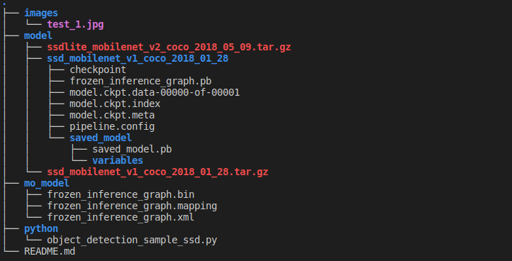
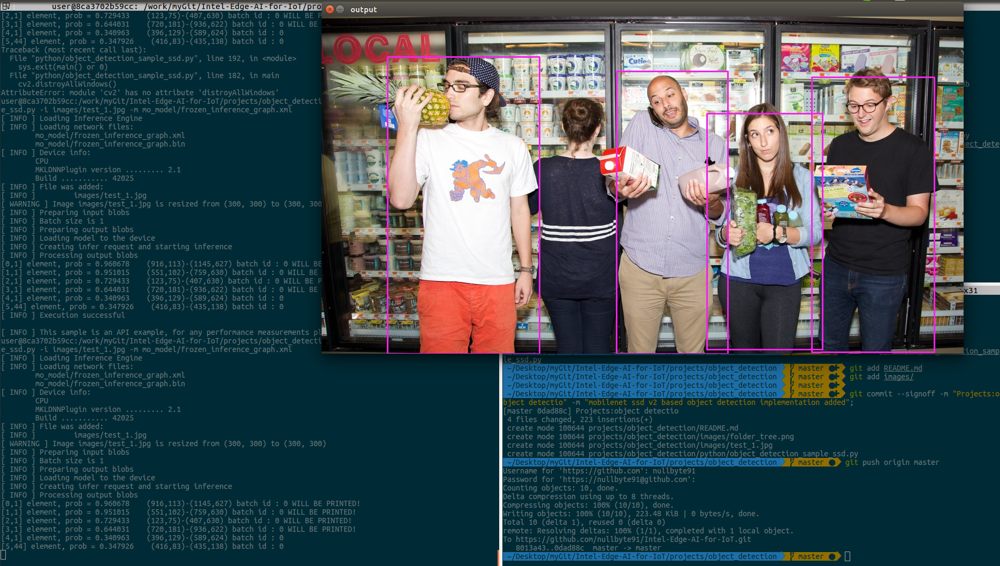

# Object detection

#### Project tree


```python
# Folder creation 
mkdir -p images # Test images
mkdir -p model # Tensorflow model
mkdir -p mo_model #Intel IR model
mkdir -p python #Object detection Implementation in Python
```

#### Download pre-trained model from Tensorflow or Caffe
```python
wget http://download.tensorflow.org/models/object_detection/ssdlite_mobilenet_v2_coco_2018_05_09.tar.gz -O model
```

#### Convert tf model to Intel Inference Engine Representation
```python
# For the first time, Install dep
# Under /opt/intel/openvino_2020.2.120/deployment_tools/model_optimizer/
python3 -m pip install -r requirements_tf.txt

python3 mo_tf.py --input_model=model/ssd_mobilenet_v1_coco_2018_01_28/frozen_inference_graph.pb --transformations_config /opt/intel/openvino_2020.2.120/deployment_tools/model_optimizer/extensions/front/tf/ssd_v2_support.json --tensorflow_object_detection_api_pipeline_config model/ssd_mobilenet_v1_coco_2018_01_28/pipeline.config --reverse_input_channels -o mo_model/
``` 

#### Object detection Inference
```python
python3 people_count/python/object_detection_sample_ssd.py -i /work/myGit/Intel-Edge-AI-for-IoT/projects/people_count/images/tmg-facebook_social.jpg -m /work/myGit/Intel-Edge-AI-for-IoT/projects/people_count/mo_model/frozen_inference_graph.xml
```

